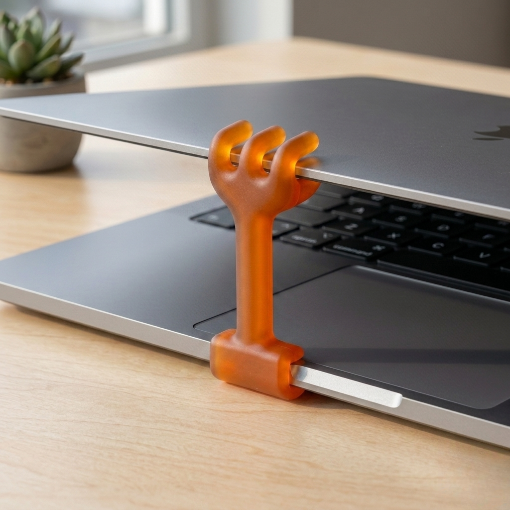
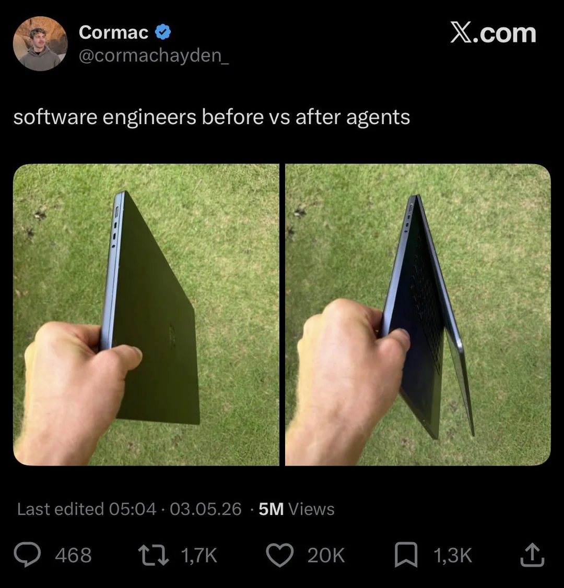

# clamshellctl

**Close the MacBook. Keep the agent running. Let the screen rest.**

<p align="center">
  
  
</p>

Lightweight native macOS CLI for Apple Silicon MacBook clamshell sessions. It
keeps the machine awake on AC power, dims the built-in display, mutes the default
audio output, and restores when you come back, without AppleScript or
Accessibility permissions.

Tested on Apple Silicon MacBook Pro hardware and designed for M1, M2, M3, and
M4 family Macs.

ClamshellCtl also includes experimental source for a small macOS menu bar app,
but the public Homebrew distribution is CLI-only for now.

Agent skills for Codex and Claude Code are included so assistants can suggest a
clamshell session before long-running local work. See
[`docs/agent-skills.md`](docs/agent-skills.md).

## Why

Existing tools cover parts of this workflow:

- [Amphetamine](https://iffy.freshdesk.com/support/solutions/articles/48001077199-amphetamine-closed-display-mode): keep-awake app
- [Sleepless](https://github.com/Aboudjem/Sleepless): lid-closed keep-awake GUI
- `caffeinate`: sleep prevention
- `pmset disablesleep`: raw system command
- [`brightness`](https://github.com/nriley/brightness): display brightness CLI

ClamshellCtl is intentionally narrower: a lightweight CLI for AI-agent and
clamshell sessions. It is not just keep-awake. It bundles the session controls
you usually want when the agent keeps working and you want to close the MacBook:

- keep work running with the MacBook closed
- minimize built-in display brightness
- mute audio
- restore when keyboard, mouse, or trackpad activity resumes

## Install with Homebrew

```sh
brew tap dotcom07/clamshellctl
brew install clamshellctl
```

`clamshellctl on` starts a clamshell session:

- sets `pmset -c disablesleep 1`
- sets the built-in display brightness to `0.0`
- mutes the default output device
- waits for keyboard, mouse, or trackpad activity, then restores with `off`

`clamshellctl off` restores:

- `pmset -c disablesleep 0`
- the brightness value saved by the last `clamshellctl on`
- the output mute state saved by the last `clamshellctl on`

If no saved state is available, `off` falls back to brightness `0.5` and output
mute off.

## Build

```sh
make
```

The binary is written to:

```sh
build/clamshellctl
```

Install it somewhere on your `PATH`:

```sh
sudo make install
```

Build the menu bar app:

```sh
make app
open build/ClamshellCtl.app
```

## Use

Run it from your normal user session:

```sh
clamshellctl on
clamshellctl on 30m
clamshellctl on --for 2h
clamshellctl on --until-activity
clamshellctl on 2h --until-activity
clamshellctl off
clamshellctl status
clamshellctl diag
clamshellctl --help
clamshellctl --version
```

Bare `clamshellctl on` keeps the command running until keyboard, mouse, or
trackpad activity resumes, then restores with `off`. A short grace period avoids
restoring immediately because of the input used to start the command.

Timed sessions keep the command running until the timer ends, then restore with
`off`. Duration suffixes can be `s`, `m`, or `h`; bare numbers are seconds. Add
`--until-activity` to a timed session to restore when either the timer expires or
activity resumes.

`on` and `off` call `sudo pmset` internally because `pmset disablesleep` requires
root. Brightness and audio mute are still changed from the user session.

## Experimental Menu Bar App

The repo contains an experimental menu bar app, but it is not distributed through
Homebrew yet. The CLI is the supported public path.

The GUI lives in the top-right macOS menu bar. It is intentionally small:

- Turn On
- Turn Off
- Turn On for 30 minutes, 1 hour, 2 hours, or a custom timer
- Turn On Until Activity
- Optional Strong Mode

Standard Mode is the default. It uses the public macOS power assertion API, dims
the built-in display, and mutes audio without asking for an administrator
password. It is best for a quick, low-risk brightness-and-mute workflow.

If your goal is to close the MacBook while an AI agent, build, download, or other
long-running job continues, use the CLI. Standard Mode may still allow macOS to
sleep when the display is closed, even though brightness and audio mute work.

Strong Mode is optional. It is for users who specifically want the GUI to use the
same stronger `pmset disablesleep` behavior as the CLI. When enabled, the app asks
for an administrator password once to install a narrow sudoers rule. That rule
allows only these two system commands without a password:

```sh
/usr/bin/pmset -c disablesleep 1
/usr/bin/pmset -c disablesleep 0
```

ClamshellCtl itself is not allowed to run as root. The Homebrew-installed binary
is not placed in sudoers. This keeps the security boundary focused on Apple's
system `pmset` tool and exactly two argument sets.

You can remove Strong Mode from the menu bar app at any time. Standard Mode keeps
working after Strong Mode is removed.

## Public App Distribution

The terminal command is the easiest first release because Homebrew builds it
from source and installs it like other command-line tools.

The menu bar app is not distributed through Homebrew yet. Public macOS apps need
Developer ID signing and Apple notarization; without that, macOS Gatekeeper can
warn that the app is from an unidentified developer, even if the code is open
source.

For non-developer users, the intended public path is:

1. Install from Homebrew.
2. Use the CLI for closed-display, long-running work.
3. Treat the menu bar app as local experimental source only.

Until the app is Developer ID signed and notarized, the CLI remains the
recommended stable path. See
[`docs/distribution.md`](docs/distribution.md) for Gatekeeper troubleshooting and
the signing/notarization release flow.

## Notes

Brightness control tries three native macOS paths in this order:

1. `DisplayServices.framework`
2. `CoreDisplay.framework`
3. `IODisplaySetFloatParameter`

This avoids AppleScript keystroke automation, so it should not need Accessibility
permissions. `DisplayServices` and `CoreDisplay` do not ship public headers, so this
tool links their exported symbols weakly and falls back when a path is unavailable.

On Apple Silicon MacBook Pros where Homebrew `brightness` fails with an IOKit
error, `clamshellctl diag` should show whether `DisplayServices` or
`CoreDisplay` can read the built-in display brightness.

The GUI icon uses Twemoji Spiral Shell under CC BY 4.0. See `NOTICE` for
attribution.
